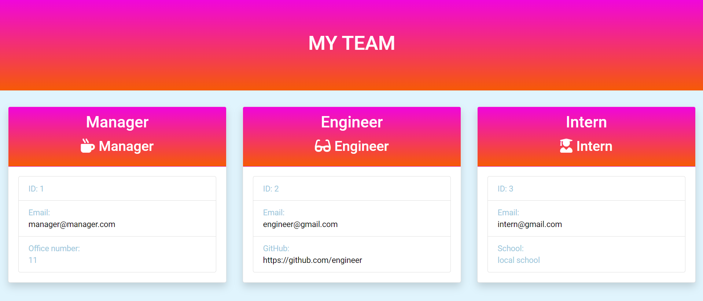

# Team Profile Generator

## Description

This application will take in information about employees on a software engineering team, then generates an HTML webpage that displays summaries for each person. Application also includes provided with tests, so make sure every part of your code passes each provided test.

## Table of contents

- [Team Profile Generator](#team-profile-generator)
  - [Description](#description)
  - [Table of contents](#table-of-contents)
  - [User story](#user-story)
  - [Usage](#usage)
  - [Installation](#installation)
  - [Screenshots](#screenshots)
  - [Technologies Used](#technologies-used)
  - [Tests](#tests)
  - [License](#license)
  - [Questions](#questions)

## User story

- As a manager I wants to generate a webpage
- that displays my team's basic info
- so that a user have quick access to their emails and GitHub profiles.

## Usage

To initiate the app via the command line, navigate to the main directory of the project and run:

<pre> <code> node index.js </code> </pre>

The application starts by requesting the user to provide details for the Manager:

- name
- employee ID
- email address
- office number

Then, the user is presented with options to add either an Engineer or an Intern, or to finish the team profile.

When adding an Engineer, the user is asked for:

- Engineer's name
- email address
- employee ID
- Github username

When an Intern is being added, the user is prompted for:

- Intern's name
- email address
- employee ID
- school

Once the team is complete, the data is written to the output folder, and the user can view their finalized team creation in team.html

## Installation

1. Fork, download or clone the repository to your local machine.
2. Ensure you have Node.js installed as it is a prerequisite for running the application.
3. Execute the command npm install to install the necessary npm packages.

## Screenshots

## Technologies Used

Node.js, OOP, TDD, Jest, Inquirer, HTML, CSS, JavaScript, Bootstrap

## Tests

Use `npm run test` to run Jest for tests on constructors.

<pre> <code> npm run test </code> </pre>

## License

This project is licensed under the terms of the MIT license.

## Questions

If you have any questions about the repo, open an issue or contact me directly at here [here](mailto:9394hohoho@gmail.com). You can find more of my work at [github/Louie888A](https://github.com/Louie888A).
